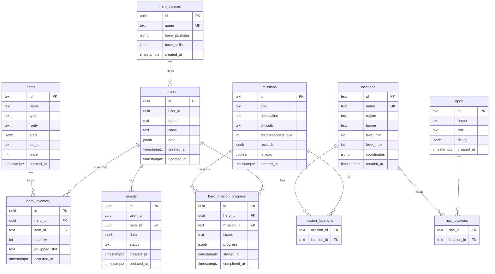

# Banco de Dados — Forjador de Heróis

## Diagrama ER (Mermaid)

## Restrições e Integridade
- `heroes.user_id` obrigatório; RLS por `auth.uid()` em leitura/atualização.
- Chaves estrangeiras com `ON DELETE CASCADE` em inventário e progresso.
- `missions` e `npcs` vinculados a `locations` via tabelas de junção.
- `quests.status` restrito a `active`, `completed`, `failed`.

## Índices
- `heroes(user_id)`, `heroes(updated_at)`.
- `quests(user_id)`, `quests(hero_id)`, `quests(updated_at)`.
- `hero_inventory(hero_id)`, `hero_inventory(item_id)`.
- `hero_mission_progress(hero_id, status)`, `hero_mission_progress(mission_id, status)`.
- `items(type)`, `items(rarity)`, `locations(name)`, `npcs(role)`.

## Scripts
- Criação de schema: `supabase/heroforge_schema.sql`.
- Tabela de `quests`: `supabase/quests.sql`.
- Seeds iniciais: `supabase/seed_core.sql`.
- Políticas RLS: `supabase/heroes_quests_rls.sql`.
- Índices adicionais: `supabase/indexes.sql`.

## Aplicação
- Executar os scripts no painel SQL do Supabase na ordem: schema → quests → RLS → índices → seeds.
- As tabelas `heroes` e `quests` são usadas pelo app via `supabase.from('heroes'|'quests')`.