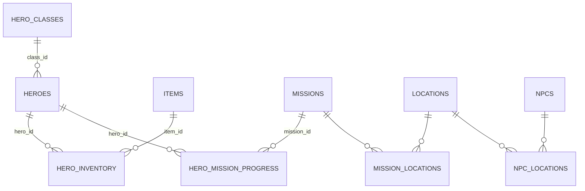

# Estrutura de Banco de Dados — Forjador de Heróis

## Visão Geral
- Banco em PostgreSQL/Supabase com separação por domínio: Heróis, Itens, Missões, NPCs e Localizações.
- Relacionamentos via tabelas de junção para inventário e progresso de missões.
- Atributos e habilidades modelados em `JSONB` para flexibilidade.

## Diagrama ER (Mermaid)

## Tabelas
- `hero_classes`: classes de herói com atributos/skills base
- `heroes`: heróis com classe, nível, XP, atributos e habilidades
- `items`: itens (tipo, raridade, stats)
- `locations`: locais do mundo (região, bioma, nível)
- `missions`: missões (dificuldade, nível recomendado, recompensas)
- `npcs`: personagens não-jogadores (função, diálogos)
- `hero_inventory`: inventário e equipáveis do herói
- `hero_mission_progress`: progresso de missões por herói
- `mission_locations`: mapeamento missão → localização
- `npc_locations`: mapeamento NPC → localização

## Índices e Integridade
- Índices em campos críticos (`heroes.name`, `items.type`, `hero_mission_progress.status`, etc.)
- Restrições de integridade:
  - FKs com `ON DELETE` apropriado
  - `CHECK` para valores mínimos (ex.: `level >= 1`, `quantity >= 0`)
  - `UNIQUE` em chaves compostas (inventário/equipamento e progresso de missões)

## Scripts
- Criação: `supabase/heroforge_schema.sql`
- População: `supabase/heroforge_seed.sql`
- RLS e políticas: `supabase/heroforge_rls.sql`

## Dados Iniciais
- Classes: Warrior, Mage, Archer
- Itens: armas/armaduras/acessórios básicos
- Missões: First Steps, Forest Hunt, Dungeon Depths
- NPCs: Elder Trainer, Guild Master, Wandering Merchant
- Localizações: Capital of Altharion, Greenwood Forest, Dungeon of Echoes

## Observações
- Tipos enumerados para garantir consistência: `item_type`, `item_rarity`, `mission_difficulty`, `progress_status`, `npc_role`.
- `JSONB` em atributos/skills e stats para evolução futura sem migrações complexas.
- RLS: heróis e suas tabelas derivadas são restritas por `auth.uid()`; tabelas de catálogo (itens, missões, locais, NPCs) têm leitura pública.